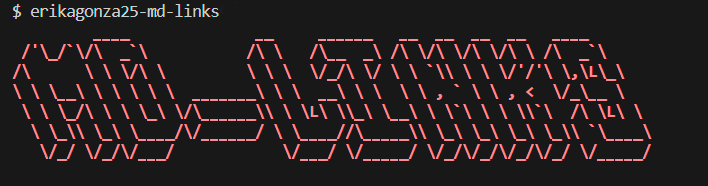
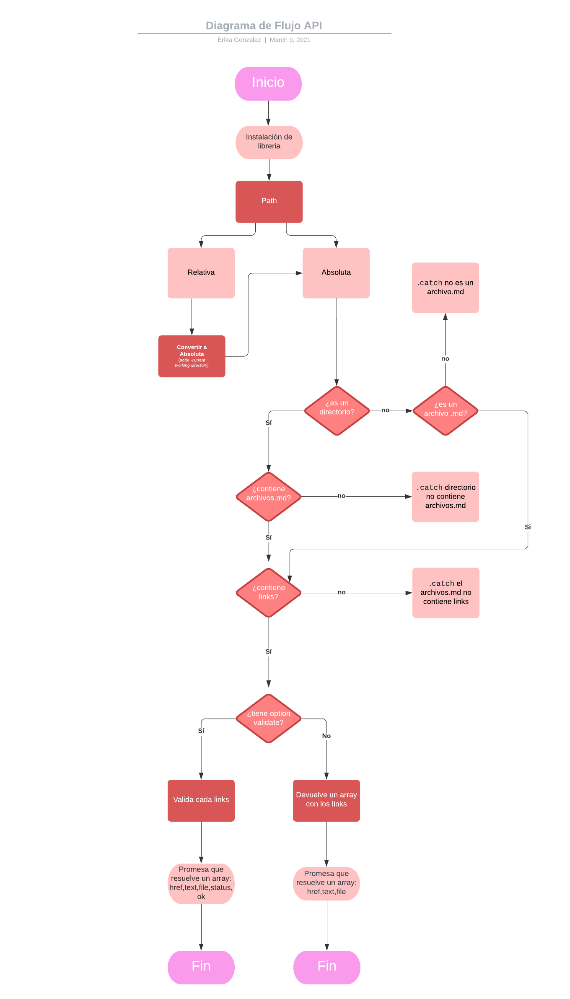
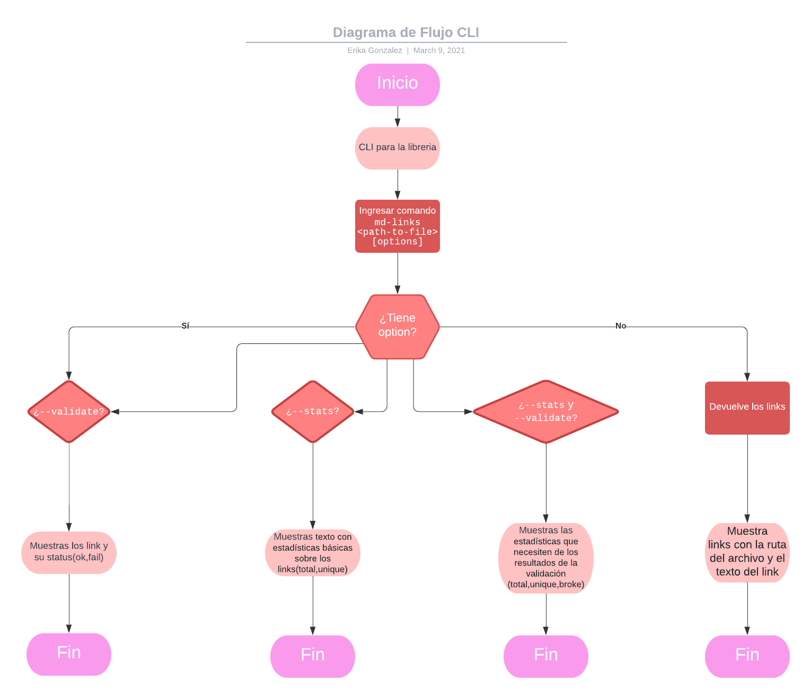

# Markdown Links



Es una librería que permite extraer los links dentro de un archivo Markdown (.md) y validar los estatus de cada uno

## Instalación

npm install erikagonza25-md-links

## Diagrama de Flujo



---



### Archivos del proyecto

- `README.md` con descripción del módulo, instrucciones de instalación/uso,
  documentación del API y ejemplos. Todo lo relevante para que cualquier
  developer que quiera usar tu librería pueda hacerlo sin inconvenientes.
- `index.js`: Desde este archivo debes exportar **una** función (`mdLinks`).
- `package.json` con nombre, versión, descripción, autores, licencia,
  dependencias, scripts (pretest, test, ...)
- `.editorconfig` con configuración para editores de texto. Este archivo no se
  debe cambiar.
- `.eslintrc` con configuración para linter. Este archivo no
  se debe cambiar.
- `.gitignore` para ignorar `node_modules` u otras carpetas que no deban
  incluirse en control de versiones (`git`).
- `test/md-links.spec.js` debe contener los tests unitarios para la función
  `mdLinks()`. Tu inplementación debe pasar estos tets.

# Este proyecto consta de **dos partes** listadas aquí

### 1) JavaScript API

El módulo debe poder **importarse** en otros scripts de Node.js y debe ofrecer la
siguiente interfaz:

#### `mdLinks(path, options)`

##### Argumentos

- `path`: Ruta **absoluta** o **relativa** al archivo o directorio. Si la ruta pasada es
  relativa, debe resolverse como relativa al directorio desde donde se invoca
  node - _current working directory_).
- `options`: Un objeto con **únicamente** la siguiente propiedad:
  - `validate`: Booleano que determina si se desea validar los links
    encontrados.

##### Valor de retorno

La función debe **retornar una promesa** (`Promise`) que **resuelva a un arreglo**
(`Array`) de objetos (`Object`), donde cada objeto representa un link y contiene
las siguientes propiedades:

- `href`: URL encontrada.
- `text`: Texto que aparecía dentro del link (`<a>`).
- `file`: Ruta del archivo donde se encontró el link.

#### Ejemplo (resultados como comentarios)

```js
const mdLinks = require("md-links");

mdLinks("./some/example.md")
  .then((links) => {
    // => [{ href, text, file }]
  })
  .catch(console.error);

mdLinks("./some/example.md", { validate: true })
  .then((links) => {
    // => [{ href, text, file, status, ok }]
  })
  .catch(console.error);

mdLinks("./some/dir")
  .then((links) => {
    // => [{ href, text, file }]
  })
  .catch(console.error);
```

### 2) CLI (Command Line Interface - Interfaz de Línea de Comando)

El ejecutable de nuestra aplicación debe poder ejecutarse de la siguiente
manera a través de la **terminal**:

`md-links <path-to-file> [options]`

Por ejemplo:

```sh
$ md-links ./some/example.md
./some/example.md http://algo.com/2/3/ Link a algo
./some/example.md https://otra-cosa.net/algun-doc.html algún doc
./some/example.md http://google.com/ Google
```

El comportamiento por defecto no debe validar si las URLs responden ok o no,
solo debe identificar el archivo markdown (a partir de la ruta que recibe como
argumento), analizar el archivo Markdown e imprimir los links que vaya
encontrando, junto con la ruta del archivo donde aparece y el texto
que hay dentro del link (truncado a 50 caracteres).

#### Options

##### `--validate`

Si pasamos la opción `--validate`, el módulo debe hacer una petición HTTP para
averiguar si el link funciona o no. Si el link resulta en una redirección a una
URL que responde ok, entonces consideraremos el link como ok.

Por ejemplo:

```sh
$ md-links ./some/example.md --validate
./some/example.md http://algo.com/2/3/ ok 200 Link a algo
./some/example.md https://otra-cosa.net/algun-doc.html fail 404 algún doc
./some/example.md http://google.com/ ok 301 Google
```

Vemos que el _output_ en este caso incluye la palabra `ok` o `fail` después de
la URL, así como el status de la respuesta recibida a la petición HTTP a dicha
URL.

##### `--stats`

Si pasamos la opción `--stats` el output (salida) será un texto con estadísticas
básicas sobre los links.

```sh
$ md-links ./some/example.md --stats
Total: 3
Unique: 3
```

También podemos combinar `--stats` y `--validate` para obtener estadísticas que
necesiten de los resultados de la validación.

```sh
$ md-links ./some/example.md --stats --validate
Total: 3
Unique: 3
Broken: 1
```
